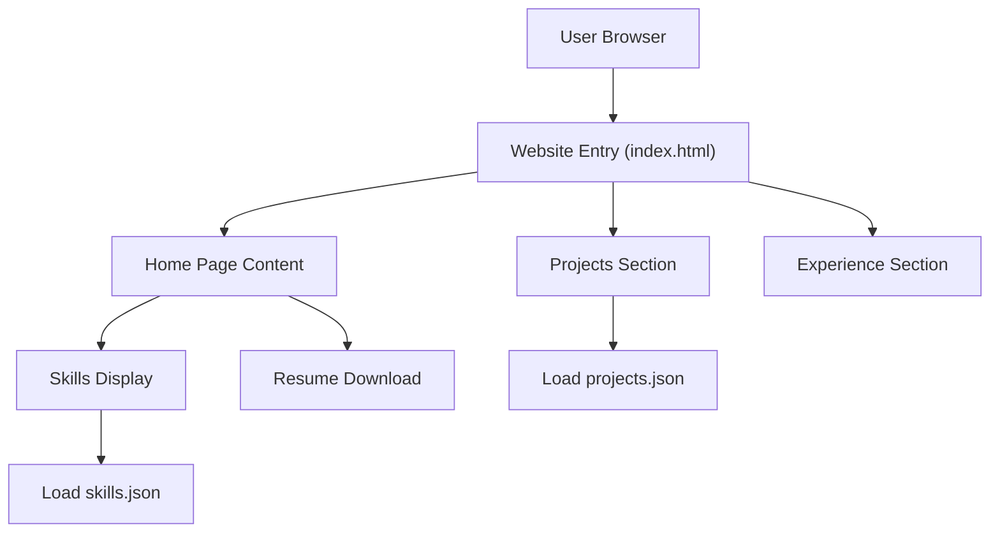

# 🚀 SoloHunter110's Dynamic Portfolio Website

<p align="center"></p>

## Short Description
Presenting a cutting-edge personal portfolio website meticulously crafted to showcase skills, projects, and professional journey with unparalleled elegance and interactive flair. This dynamic platform is engineered for responsiveness, ensuring a flawless experience across all devices, and leverages modern web technologies to bring a developer's story to life.

## ✨ Key Features
*   **Interactive & Engaging UI**: Features dynamic backgrounds and engaging visual effects powered by `particles.min.js`, creating an immersive user experience.
*   **Dynamic Content Management**: Projects and skills are powered by easily configurable JSON files (`projects.json`, `skills.json`), allowing for effortless content updates without touching core code.
*   **Comprehensive Sections**: Dedicated and richly designed sections for Home, Projects, Experience, and a custom 404 error page.
*   **Automated CI/CD**: Seamless and efficient deployment pipeline configured with GitHub Actions (`ci-cd.yml`) ensures continuous integration and delivery.
*   **Downloadable Resume**: Provides instant access to the developer's professional resume (`resume.pdf`) for easy review.
*   **Responsive Design**: Built with a mobile-first approach, guaranteeing optimal viewing and interaction on any screen size.

## Who is this for?
This portfolio website is designed for:
*   **Tech Recruiters & Hiring Managers**: Quickly assess the developer's capabilities, experience, and project work.
*   **Fellow Developers & Collaborators**: Explore the technical stack and project insights for potential collaboration.
*   **Anyone Interested in Modern Web Development**: A live demonstration of best practices in frontend design and development.

## Technology Stack & Architecture
This project is a testament to robust frontend development practices, built entirely with static web technologies for speed, security, and scalability.

*   **Frontend Languages**: HTML5, CSS3 (extensive custom styling in `assests/css/style.css`), JavaScript (Vanilla JS, `app.js`, `script.js`).
*   **Interactive Libraries**: `particles.min.js` for captivating background visuals.
*   **Content Management**: Flat-file JSON (`projects.json`, `skills.json`) for data-driven content sections.
*   **Automation**: GitHub Actions (`.github/workflows/ci-cd.yml`) for Continuous Integration and Continuous Deployment.

## 📊 Architecture & Database Schema
As a static website, this project doesn't utilize a traditional backend database. Its architecture is focused on client-side rendering and navigation, making it incredibly fast and efficient. The core flow depicts how users interact with the rich content.



## ⚡ Quick Start Guide
Getting this portfolio website up and running locally is straightforward.

1.  **Clone the Repository**:
    ```bash
    git clone https://github.com/SoloHunter110/portfolio_website.git
    ```
2.  **Navigate to the Project Directory**:
    ```bash
    cd portfolio_website
    ```
3.  **Open in Browser**:
    Simply open the `index.html` file in your web browser, or for a more robust local environment, use a simple HTTP server (e.g., `python3 -m http.server` from the root directory).

## 📜 License
This project is released under the terms of the MIT License. See the `LICENSE` file for more details.